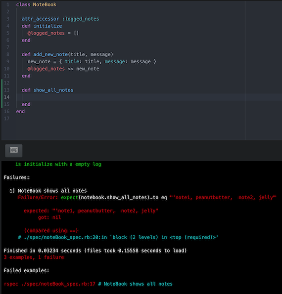
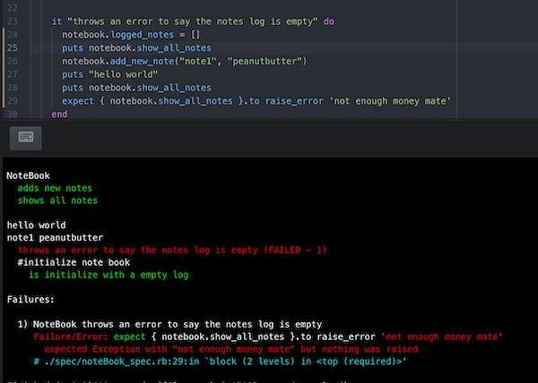

# Note_App

This is small notes application to practice TDD and OOP principles.
A user can create notes, which will get saved and the user can also show all logged notes.

### Setup
 1. Download/Clone this repo(https://github.com/MariusGG/Note_App)
 2. Open your terminal and CD into the Directory
 3. Install gem dependencies by running bundle install
 4. Open the file in your terminal ( notebook.rb )

### Learning goals

TDD
  * Write a unit test that fails
  * Write enough code to make the test pass
  * Refactor the code from the previous step

OOP
  * Composing objects that manages simple tasks to create complex computer programs.
  * Classes are blueprints for objects
  * Objects are created or instantiated from classes

### Testing and Linter

``Rspec``
``Rubocop``

### Process
I made regular commits after writing and passing tests. Following the TDD process helped me write clear code, which is easy to change. I used 'puts' statements to debug when I need to find out what a method was returning.
This approach was a helpful debugging method, which I would use regularly. Making regular git commits allow me to work flow to stay on track. I also used 'git add'(individual files) and 'git status'(uncommitted files)  which helped to keep a good work flow. I felt this was a good approach because this would help anyone looking through my commits follow my process.

### Screenshots

### Additionally  
More features to add with more time

* print only the title
* edit an existing note
* delete notes
